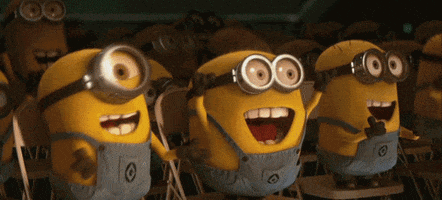

class: inverse, center, middle

```{r setup, include=FALSE}
options(htmltools.dir.version = FALSE, width = 20)

library(xaringan)
library(ggplot2)
library(gganimate)
library(gifski)
library(gapminder)
library(tinytex)
library(tidyverse)
library(knitr)
library(kableExtra)
library(fontawesome) 
library(lubridate)
library(htmltools)
library(datasauRus)
library(gganimate)
library(tsibble)
library(plotly)
opts_chunk$set(
  echo = FALSE, warning = FALSE, message = FALSE, comment = "#>",
  fig.path = 'figure/', cache.path = 'cache/', fig.align = 'center',
  fig.width = 4, fig.height = 3, fig.show = 'hold',
  cache = TRUE, external = TRUE, dev = 'png', dev.args = list(bg = "transparent")
)

hook_output <- knit_hooks$get("output")
knit_hooks$set(output = function(x, options) {
   lines <- options$output.lines
   if (is.null(lines)) {
     return(hook_output(x, options))  # pass to default hook
   }
   x <- unlist(strsplit(x, "\n"))
   more <- "..."
   if (length(lines)==1) {        # first n lines
     if (length(x) > lines) {
       # truncate the output, but add ....
       x <- c(head(x, lines), more)
     }
   } else {
     x <- c(more, x[lines], more)
   }
   # paste these lines together
   x <- paste(c(x, ""), collapse = "\n")
   hook_output(x, options)
 })
theme_set(
  theme_minimal(base_size = 6) +
  theme(
    legend.position = "left",
    plot.background = element_rect(fill = "transparent"),
    legend.background = element_rect(fill = "transparent")
  )
)
```

## gganimate nedir?

<hr>

-   R'da animasyonlu grafikler oluşturmak için ggplot2 paketinin bir uzantısıdır.
-   Orijinali David Robinson tarafından yazılmıştır.
-   Thomas Lin Pedersen tarafından 2018 ve 2019'da güncellenmiştir.

Pedersen gganimate paketini şöyle tanımlıyor:

**Animasyonun nasıl tanımlanacağına dair teorik bir omurga ve aynı zamanda belirlenmiş teorik omurgaların bir uygulamasıdır.**

## Animasyonların yapısı

<hr>

### Grafik hareketlerini aşağıdaki özelliklerle kontrol etme


- Transitions ~ Geçişler
- Views ~ Görüntülemeler
- Shadows ~ Gölgeler
- Entrances/Exits ~ Girişler/Çıkışlar
- Easing ~ Hafifletme


---


### Transitions ~ Geçişler

<hr>

- Verilerin nasıl yayılması gerektiğini ve zaman içinde kendisiyle nasıl ilişkili olduğunu tanımlar.

```{r transition-tbl}
tribble(
  ~ Fonksiyon, ~ Tanım,
  "transition_manual", "Doğrudan çerçeve üyeliğini belirterek bir animasyon oluşturma",
  "transition_states", "Verilerin birkaç farklı aşaması arasında geçiş",
  "transition_time", "Zaman içinde farklı durumlar arasında geçiş",
  "transition_components", "Grafik bileşenlerini kendi yaşam döngüleri boyunca geçiş",
  "transition_reveal", "Belirli bir boyut boyunca verileri ortaya çıkarma",
  "transition_layers", "Grafiğe katmanlar ekleme",
  "transition_filter", "Farklı filtreler arasında geçiş",
  "transition_events", "Bireysel olayları içeri ve dışarı aktarın",
  "transation_null", "Animasyon boyunca tüm verileri sabit tutma"
) %>% 
  kable(format = "html") %>%
  kableExtra::kable_styling(font_size = 16)
```

---

```{r include=FALSE}
p<-ggplot(gapminder, 
       aes(x = gdpPercap, y=lifeExp, size = pop, colour = country) ) +
  geom_point(show.legend = FALSE, alpha = 0.7) +
  scale_x_log10() +
  scale_color_viridis_d() +
  scale_size(range = c(2, 12)) +
  labs(x = "GDP per capita", y = "Life expectancy")+
  theme_minimal()
```


#### Statik arsa

<hr>

```{r statik, echo=TRUE, message=FALSE, warning=FALSE, fig.height=3, fig.width=7}
ggplot(gapminder, 
       aes(x = gdpPercap, y=lifeExp, size = pop, colour = country) ) +
  geom_point(show.legend = FALSE, alpha = 0.7) +
  scale_x_log10() +
  scale_color_viridis_d() +
  scale_size(range = c(0.1, 5)) +
  labs(x = "GDP per capita", y = "Life expectancy")
```

---

#### transition_time()
```{r transition_gif1, eval=F, echo=T, message=FALSE, warning=FALSE}
p + transition_time(year) +
  labs(title = "Year: {frame_time}")
```

```{r output1, ref.label="transition_gif1", echo=FALSE, cache=TRUE, fig.height =2.5, fig.width=3.5}
```

---

```{r transition_gif2, eval=F, echo=T, message=FALSE, warning=FALSE}
p + facet_wrap(~continent) +
  transition_time(year) +
  labs(title = "Year: {frame_time}")
```

```{r output2, ref.label="transition_gif2", echo=FALSE, cache=TRUE, fig.height =2, fig.width=4}
```

---

#### transition_states()
```{r transition_gif3, eval=F, echo=T, message=FALSE, warning=FALSE}
ggplot(iris, aes(x = Petal.Width, y = Petal.Length, colour = Species)) + 
  geom_point(aes(group = seq_along(Species))) + 
  transition_states(Species,
                    transition_length = 2,
                    state_length = 1)
```

```{r output3, ref.label="transition_gif3", echo=FALSE, cache=TRUE, fig.height = 2, fig.width=3}
```

---

#### transition_reveal()
```{r transition_gif4, eval=F, echo=T, message=FALSE, warning=FALSE}
ggplot(
  airquality,
  aes(Day, Temp, group = Month, color = factor(Month))) +
  geom_line() +
  scale_color_viridis_d() +
  labs(x = "Day of Month", y = "Temperature") +
  theme(legend.position = "top")+ 
  geom_point(aes(group = seq_along(Day))) +
  transition_reveal(Day) +
  theme_minimal()
```

---

```{r output4, ref.label="transition_gif4", echo=FALSE, cache=TRUE, fig.height = 3, fig.width=4}
```

---

### Views ~ Görüntülemeler

<hr>

-  Animasyon boyunca konumsal ölçeklerin nasıl değişmesi gerektiğini tanımlar.

```{r views-tbl}
tribble(
  ~ Fonksiyon, ~ Tanım,
  "view_follow", "Geçerli veri aralığını takip etmek için görünümü değiştirme",
  "view_step", "Görünümün geçişler arasında statik olması dışında view_follow'a benzer",
  "view_step_manual", "view_step ile aynı, ancak görünüm aralıkları manuel olarak tanımlanır",
  "view_zoom", "view_step'e benzer, ancak önce uzaklaştırıp sonra yakınlaştırınca daha yumuşak görünür",
  "view_zoom_manual", "Görünüm aralıklarının manuel olarak tanımlanması dışında view_zoom ile aynı"
) %>% 
  kable(format = "html") %>%
  kableExtra::kable_styling(font_size = 16)
```

---

#### view_follow()
```{r view_gif1, eval=F, echo=T, message=FALSE, warning=FALSE}
p + transition_time(year) +
  labs(title = "Year: {frame_time}") +
  view_follow(fixed_y = TRUE)
```

```{r output5, ref.label="view_gif1", echo=FALSE, cache=TRUE, fig.height = 2, fig.width=4}
```

---

```{r view_gif2, eval=F, echo=T, message=FALSE, warning=FALSE}
ggplot(iris, aes(Sepal.Length, Sepal.Width)) +
  geom_point() +
  labs(title = "{closest_state}") +
  transition_states(Species, transition_length = 4, state_length = 1) +
  view_follow()
```

```{r output6, ref.label="view_gif2", echo=FALSE, cache=TRUE, fig.height = 2, fig.width=2.5}
```

---

### Shadows ~ Gölgeler

<hr>

-  Zaman içindeki diğer noktalardan gelen verilerin verilen zaman noktasında nasıl sunulması gerektiğini tanımlar.

```{r shadows-tbl}
tribble(
  ~ Fonksiyon, ~ Tanım,
  "shadow_mark", "Önceki (ve/veya gelecekteki) çerçeveler kalıcı arka plan işaretleri bırakır",
  "shadow_trail", "İşaretlerin arası doldurulmuş verilerden alınması dışında shadow_mark'a benzer",
  "shadow_wake", "Zamanla boyutu (ve/veya donukluk) içinde azalan bir gölge gösterir"
) %>% 
  kable(format = "html") %>%
  kableExtra::kable_styling(font_size = 16)
```

---

#### shadow_wake()
```{r shadow_gif1, eval=F, echo=T, message=FALSE, warning=FALSE}
p + transition_time(year) +
  labs(title = "Year: {frame_time}") +
  shadow_wake(wake_length = 0.1, alpha = FALSE)
```

```{r output7, ref.label="shadow_gif1", echo=FALSE, cache=TRUE, fig.height = 2, fig.width=4}
```

---

```{r shadow_gif2, eval=F, echo=T, message=FALSE, warning=FALSE}
ggplot(iris, aes(Petal.Length, Sepal.Length)) +
  geom_point(size = 2) +
  labs(title = "{closest_state}") +
  transition_states(Species, transition_length = 4, state_length = 1) +
  shadow_wake(wake_length = 0.1)
```

```{r output8, ref.label="shadow_gif2", echo=FALSE, cache=TRUE, fig.height = 2, fig.width=4}
```

---

#### shadow_mark()
```{r shadow_gif3, eval=F, echo=T, message=FALSE, warning=FALSE}
p + transition_time(year) +
  labs(title = "Year: {frame_time}") +
  shadow_mark(alpha = 0.3, size = 0.9)
```

```{r output9, ref.label="shadow_gif3", echo=FALSE, cache=TRUE, fig.height = 2, fig.width=4}
```

---

```{r include=FALSE}
library(dplyr)
mean.temp <- airquality %>%
  group_by(Month) %>%
  summarise(Temp = mean(Temp))
mean.temp
```

```{r include=FALSE}
p1 <- ggplot(mean.temp, aes(Month, Temp, fill = Temp)) +
  geom_col() +
  scale_fill_distiller(palette = "Reds", direction = 1) +
  theme_minimal() +
  theme(
    panel.grid = element_blank(),
    panel.grid.major.y = element_line(color = "white"),
    panel.ontop = TRUE
  )
p1
```

```{r shadow_gif4, eval=F, echo=T, message=FALSE, warning=FALSE}
p1 + transition_states(Month, wrap = FALSE) +
  shadow_mark()
```

```{r output10, ref.label="shadow_gif4", echo=FALSE, cache=TRUE, fig.height = 2.5, fig.width=4}
```

---

### Entrances and exits ~ Girişler/Çıkışlar

<hr>

-  Animasyon sırasında yeni verilerin nasıl görüneceğini ve ne kadar eski verilerin kaybolacağını tanımlar.

```{r enter-exit-tbl}
tribble(
  ~ Fonksiyon, ~ Tanım,
  "enter_appear/exit_disappear", "Anında görünür veya kaybolur",
  "enter_fade/exit_fade", "Opaklık, öğeleri soldurmak veya azaltmak için kullanılır",
  "enter_grow/exit_shrink", "Element boyutu sıfırdan büyüyecek veya sıfıra küçülecek",
  "enter_recolour/exit_recolour", "Arka plana karışmak için element renklerini değiştirin",
  "enter_fly/exit_fly", "Elementler belirli bir x,y konumundan/belirli konuma hareket edecektir.",
  "enter_drift/exit_drift", "Elementler göreli olarak x,y konumlarından-konumlarına kayacaktır",
  "enter_reset/exit_reset", "Önceden eklenmiş tüm giriş/çıkışları temizler"
) %>% 
  kable(format = "html") %>%
  kableExtra::kable_styling(font_size = 16)
```

---

```{r entra_gif1, eval=F, echo=T, message=FALSE, warning=FALSE}
p1 + transition_states(Month, wrap = FALSE) +
  shadow_mark() +
  enter_grow() +
  enter_fade()
```

```{r output11, ref.label="entra_gif1", echo=FALSE, cache=TRUE, fig.height = 2, fig.width=4}
```

---

```{r include=FALSE}
p3 <- ggplot(iris, aes(x = Petal.Width, y = Petal.Length)) + 
  geom_point(aes(colour = Species), size = 2) + 
  transition_states(Species,
                    transition_length = 2,
                    state_length = 1)
```

```{r entra_gif2, eval=F, echo=T, message=FALSE, warning=FALSE}
p3 + 
  enter_fade() + enter_drift(x_mod = -1) + 
  exit_shrink() + exit_drift(x_mod = 5)
```

```{r output12, ref.label="entra_gif2", echo=FALSE, cache=TRUE, fig.height = 2, fig.width=4}
```


## gganimate'in diğer fonksiyonları

<hr>

```{r fonk-tbl}
tribble(
  ~ Fonksiyon, ~ Tanım,
  "animate()", "Bir gganim nesnesini alır ve onu bir animasyona dönüştürür.",
  "anim_save()", "Animasyonu bir dosyaya kaydetmeyi sağlar.",
  "frame_vars()", "Animasyondaki karelerle ilgili meta verilere erişmeyi sağlar.",
  "split_animation()", "Animasyonu parçalara ayırmayı sağlar.",
  "ease_aes()", "Geçişler sırasında farklı estetiğin nasıl hafifletilmesi gerektiğini tanımlar.",
  "*_renderer()", "Yukarıdaki işlevler kullanılarak belirtilen animasyonun oluşturulmasını kontrol etmemizi sağlar."
) %>% 
  kable(format = "html") %>%
  kableExtra::kable_styling(font_size = 16)
```

---

```{r other_gif1, eval=F, echo=T, message=FALSE, warning=FALSE}
animate(p3+
          enter_fade()+
          exit_fly(y_loc = 1),
        renderer = gifski_renderer())
```

```{r output13, ref.label="other_gif1", echo=FALSE, cache=TRUE, fig.height = 5, fig.width=6}
```

---

```{r other_gif2, eval=F, echo=T, message=FALSE, warning=FALSE}
animate(p3 + ease_aes(x = 'bounce-out') + enter_fly(x_loc = -1) +
          exit_fade(),  width = 600, height = 400, res = 100)
```

```{r output14, ref.label="other_gif2", echo=FALSE, cache=TRUE, fig.height = 1, fig.width=6}
```

---

```{r}
data<- gapminder %>%
  group_by(year) %>%
  arrange(year, desc(gdpPercap)) %>%
  mutate(ranking = row_number()) %>%
  filter(ranking <=15)
```

```{r other_gif3, eval=F, echo=T, message=FALSE, warning=FALSE}
data %>%
  ggplot() +
  geom_col(aes(ranking, gdpPercap, fill = country)) +
  #geom_text(aes(ranking, gdpPercap, label = gdpPercap), hjust=-0.1) +
  geom_text(aes(ranking, y=0 , label = country), hjust=1.1) + 
  geom_text(aes(x=15, y=max(gdpPercap) , label = as.factor(year)), 
            vjust = 0.1, alpha = 0.1,  col = "gray", size = 3) +
  coord_flip(clip = "off", expand = FALSE) + scale_x_reverse() +
  theme_minimal() + 
  theme(panel.grid = element_blank(), 
    legend.position = "none",
    axis.ticks.y = element_blank(),
    axis.title.y = element_blank(),
    axis.text.y = element_blank(),
    plot.margin = margin(1, 4, 1, 3, "cm")) +
  transition_states(year, state_length = 0, transition_length = 2) +
  enter_fade() +
  exit_fade() + 
  ease_aes('quadratic-in-out') 
```

---

```{r output15, ref.label="other_gif3", echo=FALSE, cache=TRUE, fig.height = 3,fig.width=5}
```


## Kaynak

<hr>

<https://cran.r-project.org/web/packages/gganimate/gganimate.pdf>

<https://gganimate.com/articles/gganimate.html>

<https://www.datanovia.com/en/blog/gganimate-how-to-create-plots-with-beautiful-animation-in-r/>

<https://anderfernandez.com/en/blog/how-to-create-animations-in-r-with-gganimate/>

<https://www.alexcookson.com/post/2020-10-18-building-an-animation-step-by-step-with-gganimate/>

<https://slides.mitchelloharawild.com/wombat-gganimate/#21>

<https://github.com/numbats/gganimate-workshop>


# Beni Dinlediğiniz İçin Teşekkürler ☺


